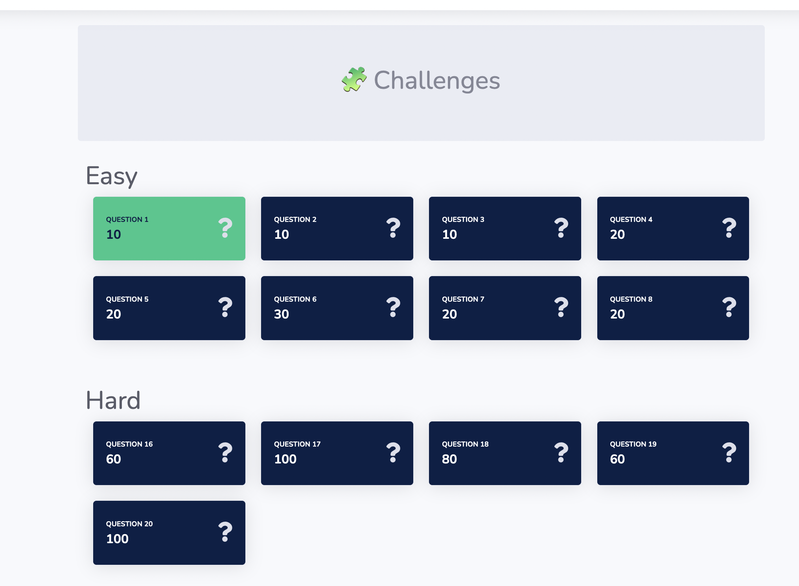
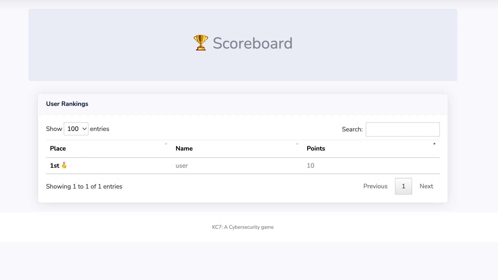

# KC7 - The Scoreboard

This is the scoreboard for the kc7 game
You can deploy this applation directly to azure or any other hosting app

# KC7 - a cybersecurity game (kc7cyber.com)

KC7 simulates an intrusion by multiple cyber threat actors against a fictitious company that spans the entire `Cyber Kill Chain`.

Players use `KQL` queries to triage logs in `Azure Data Explorer` to:
* Investigate suspicious activity in the company's environment
* Pivot on known actor indicators to uncover additional selectors and find more intrusion activity

Game players get experience triaging Web, Email, and Endpoint audit logs
